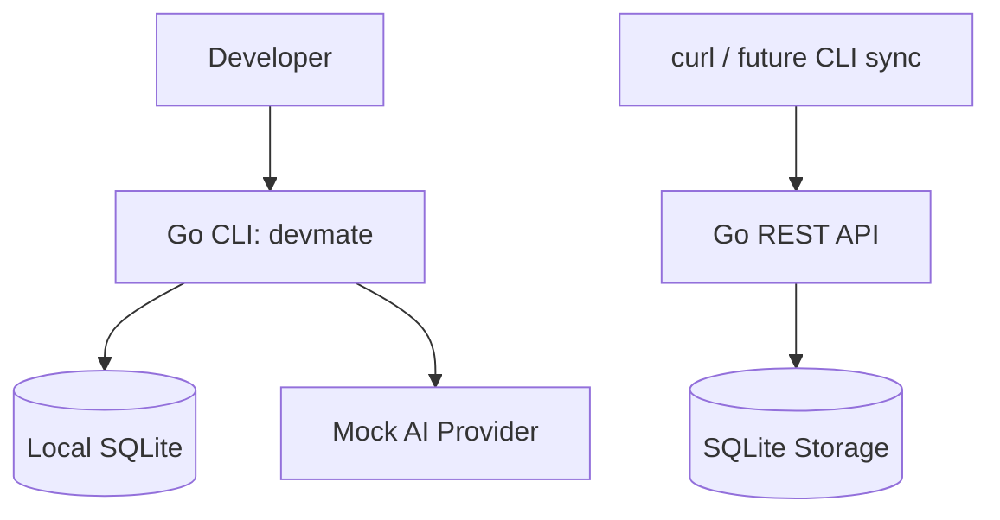

# DevMate AI

DevMate AI is an AI-powered CLI assistant for developers.

It helps developers ask technical questions from the terminal, explain errors, save useful fixes, search old solutions, and sync notes with a backend API.

## Current Status

**Stage 5:** CLI + local SQLite notes + backend REST API.

## Features

- CLI root command
- CLI version command
- Ask command with mock AI provider
- Explain error from file
- Save developer notes locally
- List saved notes
- Search saved notes
- Backend health API
- Backend notes API
- Backend search API

## Architecture



## Usage

### Run CLI

```sh
go run ./cmd/devmate
```

### Ask Question

```sh
go run ./cmd/devmate ask "explain goroutine in simple words"
```

### Explain Error

```sh
go run ./cmd/devmate explain-error --file examples/error.log
```

### Save Note

```sh
go run ./cmd/devmate save --title "Docker permission fix" --body "Check mounted volume permission"
```

### List Notes

```sh
go run ./cmd/devmate list
```

### Search Notes

```sh
go run ./cmd/devmate search "docker"
```

### Run API

```sh
go run ./cmd/api
```

### Test API

#### Health

```sh
curl http://localhost:8080/health
```

#### Create note

```sh
curl -X POST http://localhost:8080/api/v1/notes \
  -H "Content-Type: application/json" \
  -d '{"title":"Docker permission fix","body":"Check mounted volume permission"}'
```

#### List notes

```sh
curl http://localhost:8080/api/v1/notes
```

#### Search notes

```sh
curl "http://localhost:8080/api/v1/notes/search?q=docker"
```

### Run Tests

```sh
go test ./...
```

## Tech Stack

- Go
- Cobra CLI
- SQLite
- REST API
- net/http
- Docker (later)
- Swagger (later)
- Kubernetes (later)

## Roadmap

- CLI sync with backend
- Real AI provider
- Swagger docs
- Dockerfile
- Cloud deployment
- Kubernetes manifests
- Terraform starter
