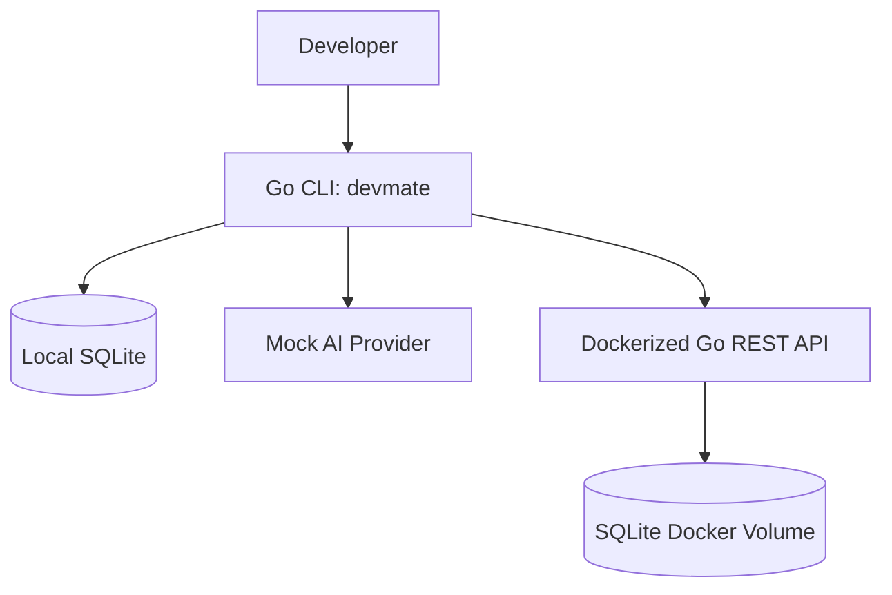

# DevMate AI

DevMate AI is an AI-powered CLI assistant for developers.

It helps developers ask technical questions from the terminal, explain errors, save useful fixes, search old solutions, and sync notes with a backend API.

## Current Status

- CLI + local SQLite notes + backend REST API + Docker.

## Features

- CLI root command
- CLI version command
- Ask command with mock AI provider
- Explain error from file
- Save developer notes locally
- List saved notes
- Search saved notes
- CLI config management
- Sync local notes with backend API
- Backend health API
- Backend notes API
- Backend search API
- Dockerized API
- Docker Compose setup

## Architecture



## Quick Start

### Run CLI

```sh
go run ./cmd/devmate
```

### Save Local Note

```sh
go run ./cmd/devmate save --title "Docker permission fix" --body "Check mounted volume permission"
```

### List Notes

```sh
go run ./cmd/devmate list
```

### Run API With Docker

```sh
docker compose up --build
```

### Test API

```sh
curl http://localhost:8080/health
```

### Sync Local Notes To API

```sh
go run ./cmd/devmate config set api_url http://localhost:8080
go run ./cmd/devmate sync
```

## API Endpoints

- `GET  /health`
- `POST /api/v1/notes`
- `GET  /api/v1/notes`
- `GET  /api/v1/notes/search?q=docker`

## Run Tests

```sh
go test ./...
```

## Build Binaries

```sh
go build -o bin/devmate ./cmd/devmate
go build -o bin/devmate-api ./cmd/api
```

## Docker Commands

```sh
docker build -t devmate-api:local .
docker compose up --build
docker compose down
```

## Tech Stack

- Go
- Cobra CLI
- SQLite
- net/http
- Docker
- Docker Compose

## Roadmap

- Real AI provider
- Swagger API docs
- Cloud deployment
- GitHub Actions
- Kubernetes manifests
- Terraform starter

